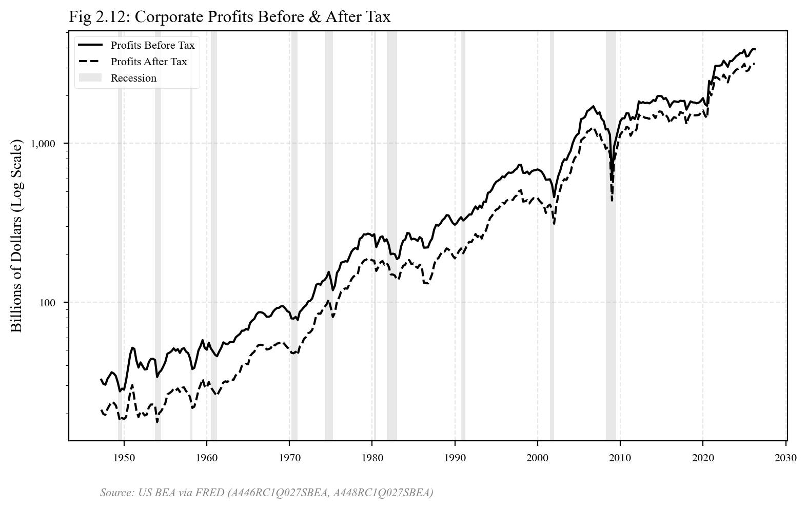
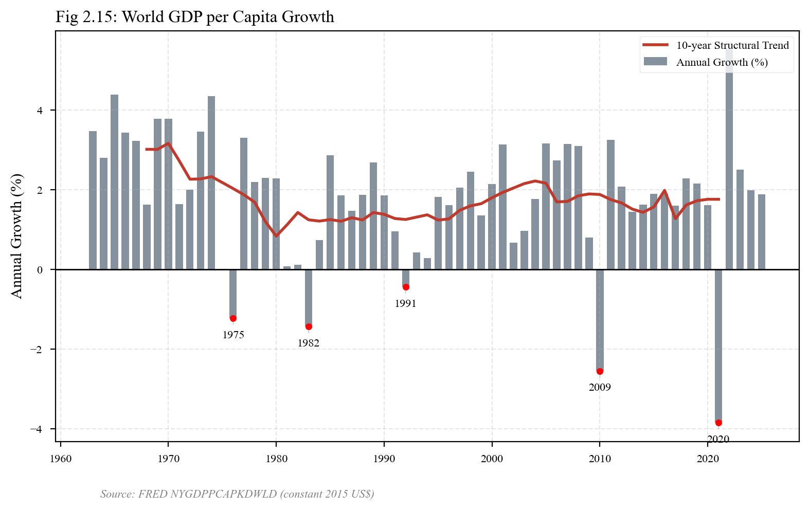
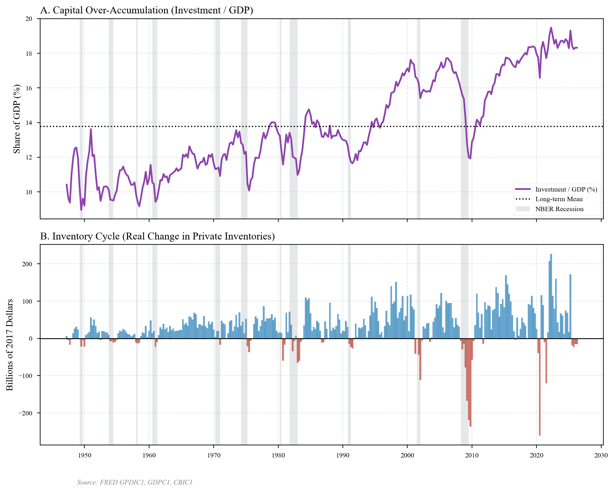
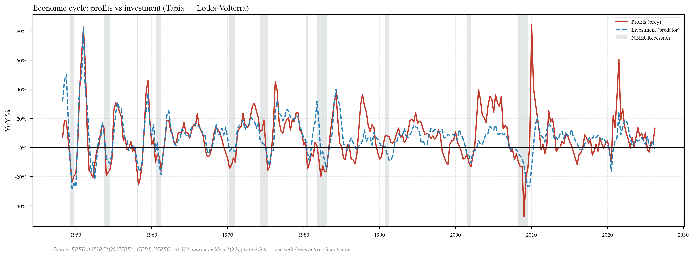
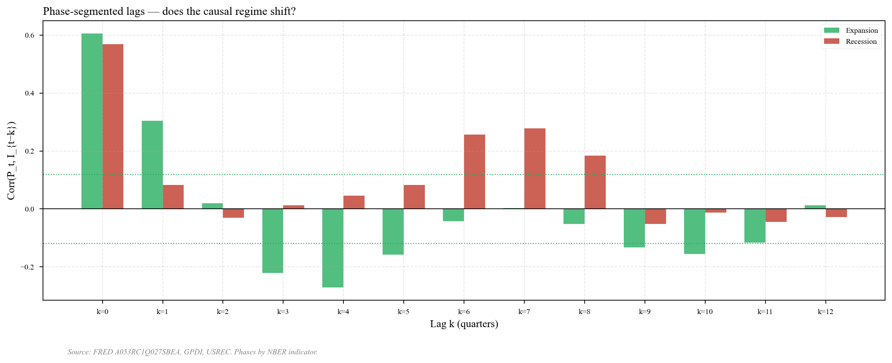
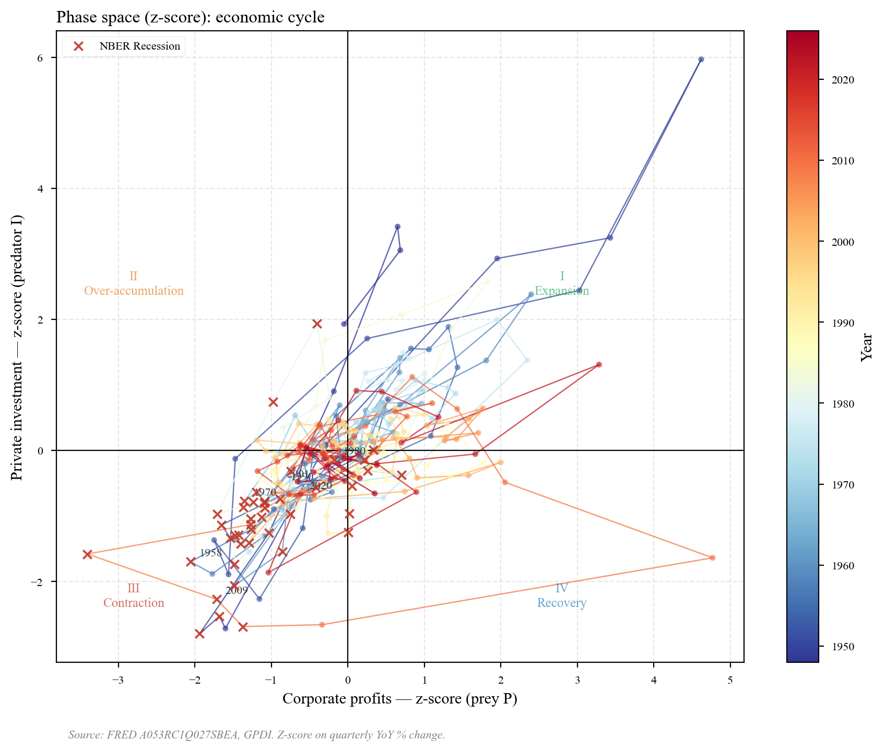

# EDA Report — Profit-Investment Cycles in the US Economy

Empirical companion to José A. Tapia's reformulation of Goodwin (1967), in which
the canonical Lotka-Volterra predator-prey system is reinterpreted with
**corporate profits** as prey and **private investment** as predator. All series
come from FRED; the period covered by the lotka_volterra dataset is **1948-Q1 →
2026-Q1** (313 quarterly observations).

> *"Movements in profits are followed some quarters later by movements in
> investment in the same direction, and movements in investment are followed by
> movements in profits in the opposite direction."*
> — Tapia (2023, *Six Crises of the World Economy*, pp. 198–199)

The pipeline that produced everything below is in [`src/etl/`](../src/etl/) and
the scripts that produced the figures are in [`src/eda/`](../src/eda/).
Reproduce with:

```bash
uv run python -m src.etl.pipeline      # data/raw/ → data/processed/
uv run python -m src.eda.run_all       # data/processed/ → report/plots/
```

---

## Data sources

All series come from [FRED](https://fred.stlouisfed.org/) (Federal Reserve Bank
of St. Louis), pulled programmatically with `pandas-datareader`. Tickers are
declared in [`configs/benchmarks/finance.yaml`](../configs/benchmarks/finance.yaml).

| Series                      | FRED ticker          | Frequency | Start    | Origin                                              |
|-----------------------------|----------------------|-----------|----------|-----------------------------------------------------|
| Corporate profits w/ IVA & CCAdj  | `A053RC1Q027SBEA`    | Quarterly | 1947-Q1 | US BEA — National Income & Product Accounts (NIPA) |
| Profits before tax          | `A446RC1Q027SBEA`    | Quarterly | 1947-Q1 | US BEA — NIPA                                       |
| Profits after tax           | `A448RC1Q027SBEA`    | Quarterly | 1947-Q1 | US BEA — NIPA                                       |
| Gross private dom. investment | `GPDI`             | Quarterly | 1947-Q1 | US BEA — NIPA                                       |
| Real GDP (chained 2017 $)   | `GDPC1`              | Quarterly | 1947-Q1 | US BEA — NIPA                                       |
| Real private investment     | `GPDIC1`             | Quarterly | 1947-Q1 | US BEA — NIPA                                       |
| Real change in inventories  | `CBIC1`              | Quarterly | 1947-Q1 | US BEA — NIPA                                       |
| World GDP per capita (constant 2015 USD) | `NYGDPPCAPKDWLD` | Annual | 1961    | World Bank, World Development Indicators            |
| NBER recession indicator    | `USREC`              | Monthly→Q | 1854    | NBER Business Cycle Dating Committee                |

Cite the FRED page for any individual series via `https://fred.stlouisfed.org/series/<TICKER>`.

## Post-processing

Code: [`src/etl/processor.py`](../src/etl/processor.py). All transforms are pure
functions, deterministic, and tested in [`tests/test_etl.py`](../tests/test_etl.py).

| Dataset             | Raw → processed                                                                                              |
|---------------------|---------------------------------------------------------------------------------------------------------------|
| `lotka_volterra`    | `pct_change(4)*100` on `PROFITS`/`INVESTMENT` → `PROFITS_YOY`, `INVEST_YOY` (drops first 4 quarters); then `(x − μ)/σ` on each → `P_z`, `I_z`. |
| `corporate_profits` | Pass-through (Fig 2.12 plots raw nominal levels on a log axis).                                              |
| `global_growth`     | `pct_change()*100` → `GROWTH`, then 10-year centered rolling mean → `TREND_10Y`.                              |
| `capital_cycle`     | `INV_RATIO = REAL_INVESTMENT / REAL_GDP * 100`.                                                              |

Two design decisions worth flagging:

- **YoY % change instead of detrending.** `pct_change(4)` removes both the
  long-run growth trend and seasonal effects in one step, and produces a series
  that is interpretable as a growth rate (Tapia's framing). The alternative —
  HP filter or band-pass — adds free parameters and well-known end-point bias.
- **Z-score on the YoY series.** Profits are 2–3× more volatile than
  investment in YoY %; the LV system has no natural unit, so feeding it the raw
  YoY collapses the orbit to a flattened ellipse (see plot 3.A). Z-scoring puts
  both axes on the same footing and is the right input for an eventual ODE
  calibration.

---

## 0 — Tapia replication figures

Descriptive figures from Tapia (2023), with the modern data window. These set
the long-run context the LV reading has to fit into.

### Corporate profits before & after tax (Tapia Fig 2.12)



Both nominal series move together on a log axis, with NBER recession bands
shaded. Profits before and after tax track each other tightly — the wedge
widens slightly during the post-2017 tax-cut window. The log-trend is broken
visibly in 1973–75, 2001, 2008–09 and 2020.

> **What this tells us.** Profits *do* contract during every NBER recession,
> but the breaks are not symmetric: the pandemic 2020 dip is recovered within
> ~6 quarters; the 2008 break leaves a lower trend slope. A pure deterministic
> LV cycle around a fixed point would *not* produce that asymmetry — it's a
> first hint that exogenous shocks have to enter the model.

### World GDP per capita growth (Tapia Fig 2.15)



Annual growth of world GDP per capita (constant 2015 USD), with a centered
10-year rolling mean. Negative-growth years are flagged.

> **What this tells us.** The structural trend (red) decelerates monotonically
> from ~3.5% in the late 1960s to ~1% post-2010. This is consistent with
> Tapia's "long downturn" reading. It also suggests the LV fixed point is
> *drifting* over decades — another reason a stationary LV alone won't fit.

### Capital over-accumulation and the inventory cycle



Top: investment as a share of real GDP. Bottom: real change in private
inventories.

> **What this tells us.** The investment-to-GDP ratio oscillates around its
> long-run mean (~17%) and the inventory series flips sign at every turning
> point. Both behaviors are consistent with the predator dynamic: a peak in
> investment overshoots demand, inventories build up, then get drawn down
> during the contraction. This is the high-frequency component the LV
> predator captures.

---

## 1 — Time-series view: do profits lead investment?

The visual test for Tapia's central claim: **YoY growth in profits peaks and
turns down before YoY growth in investment**.

### Full history (overview)



> **What this tells us.** Two things are visible at this zoom level. (1) The
> overall amplitude of the cycle compresses from the 1970s onward — consistent
> with the "great moderation" literature. (2) Three exogenous shocks dominate
> the picture: 1973 (oil), 2008 (financial), 2020 (COVID). None of these
> originate in the endogenous P↔I mechanism — they are reminders that any
> serious LV model has to be **LV + shocks**, not deterministic LV.
>
> The 1Q lead itself is invisible at this scale; see the split and zoom views
> below.

### Split into 26-year panels (lead-lag becomes legible)


> **What this tells us.** Now each quarter is wide enough that you can see the
> red curve (profits) cross zero downward 1–3 quarters before the blue curve
> (investment) at the start of every recession. This is the qualitative
> picture Tapia describes; the next section quantifies it.

### Interactive version

For arbitrary zoom and pan, open the Plotly HTML:

> [`plots/01_series_temporales.html`](plots/01_series_temporales.html)

Drag a region on the chart or the bottom range-slider to zoom in. Hover shows
the exact YoY % per quarter. (GitHub does not render HTML inline — clone the
repo and open the file in a browser.)

### Per-cycle zoom


Three reference cycles: the 1970s crisis, dot-com / 2001, and the 2008 GFC.

> **What this tells us.** In each panel the red line peaks first, then the
> blue line. The size of the lead varies (1–3 quarters), which is also a
> first hint that the LV parameters $(\alpha, \beta, \delta, \gamma)$ may not
> be stable across regimes — a question for any future calibration.

---

## 2 — Cross-correlation: lead-lag structure

### Aggregate cross-correlation function


- **Left** — `Corr(P_t, I_{t−k})`. Positive mass at negative lags ⇒ today's
  profits correlate with *future* investment.
- **Right** — `Corr(I_t, P_{t−k})`. Negative mass at positive lags ⇒ past
  investment is associated with *lower* current profits.

Numerical summary:

```
profits lead investment: best lag = 1 quarters
past investment suppresses profits: best lag = 6 quarters
```

> **What this tells us.** The two halves of Tapia's claim show up cleanly:
> the predictive coupling is profits-1Q-ahead → investment, and the negative
> feedback is investment-6Q-ago → profits. Both bars are well outside the
> 95% CI, so the result is not a sample-size artefact.
>
> **Caveat — lead-lag ≠ structural causation.** A positive `Corr(P_t, I_{t+1})`
> is consistent with several DGPs: a true causal arrow P → I, a common shock
> that hits P first, monetary-policy feedback through real rates, or omitted
> variables (capacity utilization, expectations). To upgrade this from
> *predictive* to *structural* the next step is a Granger test or an SVAR
> with sign restrictions — neither of which is in this repo.

### Phase-segmented CCF: does the regime shift?



> **What this tells us.** Splitting the sample by NBER phase shows the same
> qualitative pattern in expansion and recession, but the recession bars are
> noisier — there are only ~42 recession quarters in the sample, vs ~271 in
> expansion, so the CIs are wide. This rules out the strongest objection
> ("the lead-lag is an artefact of pooling two different regimes"), but is
> not powerful enough to detect a subtle regime change.

---

## 3 — Phase space: Lotka-Volterra topology

If the system has predator-prey dynamics, the (P, I) trajectory should trace
**anticlockwise orbits** around its fixed point. This section is where the LV
hypothesis is most directly testable visually.

### Why z-score: raw YoY vs standardized


- **A** — raw YoY %: orbit collapses to a flattened ellipse (profits 2–3×
  more volatile than investment).
- **B** — z-score: symmetric, centered on the origin.

> **What this tells us.** This isn't an interpretive plot — it's a
> methodological argument: any future ODE fit *must* run on z-scored data,
> because the LV system has no preferred unit and the raw YoY orbit is
> degenerate.

### Full z-score orbit



The four quadrants map directly onto the textbook anatomy of a capital
accumulation cycle:

| Quadrant | (P_z, I_z) | Phase             | Economic reading                                                    |
|---------:|:----------:|:------------------|:--------------------------------------------------------------------|
| I        | (+, +)     | Expansion         | High profitability pulls investment up — successful valorization.   |
| II       | (−, +)     | Over-accumulation | Investment still high by inertia, but the capital stock is already depressing the marginal rate of return. |
| III      | (−, −)     | Crisis            | Synchronous collapse; forced devalorization of capital.             |
| IV       | (+, −)     | Recovery          | Capital base purged, profits recover before investment does.        |

> **What this tells us.** The trajectory wraps around the origin many times
> — the visual signature of a limit cycle. Quadrant II is where the
> empirical content is heaviest: the data show investment growing for ≈ 5
> quarters *after* profits have peaked, which is exactly the
> over-accumulation phase Marx (Capital III, ch. 13–15) and Goodwin (1967)
> describe qualitatively.
>
> **But this is only a *necessary* signature.** Any coupled negative-feedback
> oscillator (Goodwin's wage-share dynamics, FitzHugh-Nagumo, Liénard
> systems) produces the same anticlockwise pattern. Choosing LV from inside
> that family is a parsimony + continuity-with-Goodwin call, not one this
> EDA can adjudicate.

### Per-cycle orbits


> **What this tells us.** The anticlockwise rotation is consistent across all
> five named cycles (1970, 1980–82, dot-com, GFC, COVID) — i.e. the LV
> topology is not driven by any single decade. The radii differ a lot,
> though: COVID is large and fast, the 1980–82 cycle is more constrained.
> A constant-parameter LV would predict similar amplitudes; the visible
> heterogeneity is another argument for an LV + shocks formulation.

---

## Synthesis — does this EDA support a Lotka-Volterra reading?

The three observable predictions of an LV system are all met:

- ✅ Anticlockwise rotation in (P, I) phase space (plot 3.C, all 5 cycles)
- ✅ Profits leading investment with positive lag (plot 2.A left, peak at k = −1)
- ✅ Past investment suppressing future profits (plot 2.A right, trough at k = +6)

LV is therefore **not falsified** and remains a viable hypothesis. This EDA is
sufficient to *propose* LV as a working model of the profit-investment cycle;
it is **not** sufficient to *validate* it. Validation requires (a) fitting
$(\alpha, \beta, \delta, \gamma)$, (b) handling the exogenous shocks visible
in plot 1, and (c) benchmarking against a linear VAR baseline. None of that
is in this repo.

## What's next (out of scope here)

$$\frac{dP}{dt} = \alpha P - \beta P I, \qquad \frac{dI}{dt} = \delta P I - \gamma I$$

A follow-up project could fit the four parameters above against the z-scored
data via ODE-constrained least squares (or Bayesian inference), and benchmark
the fit against an unrestricted VAR(2) on the same series. That work is **not
implemented here** — this repo is the data preparation and EDA layer only.
