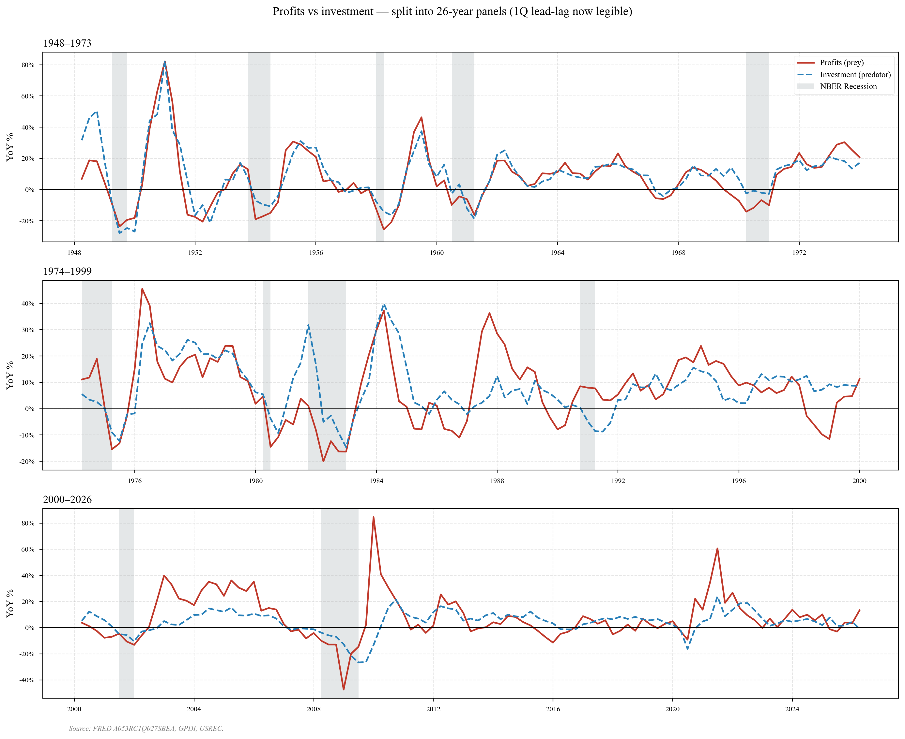
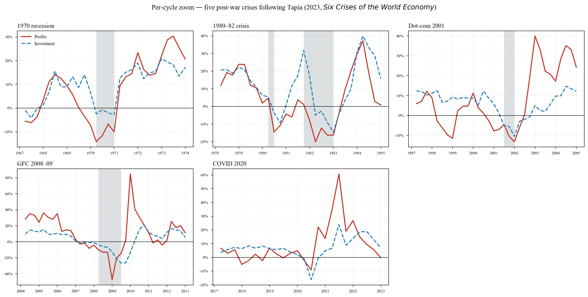
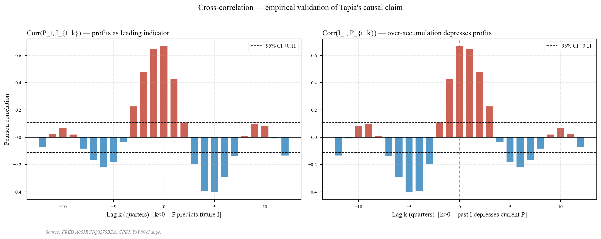
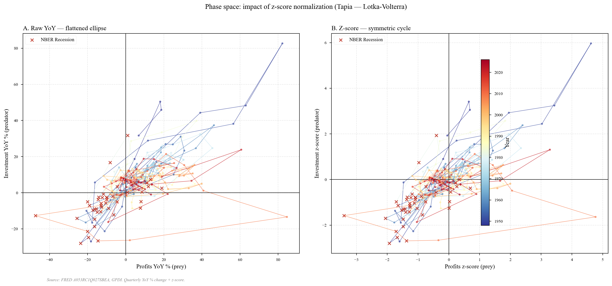
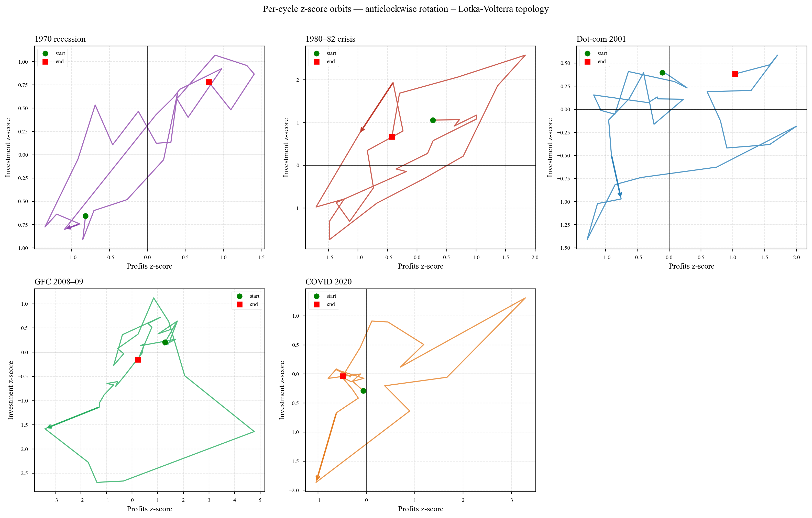

# EDA Report — Profit-Investment Cycles in the US Economy

Empirical exploration of the profit-investment cycle as articulated by José
A. Tapia in *Six Crises of the World Economy* (2023, p. 183): movements in
profits lead movements in investment by a few quarters, and past investment
is associated with weaker subsequent profits. Tapia frames this as *"a kind
of predator–prey model"* — corporate profits as prey, private investment as
predator — drawing on his exchange with **Rolando Astarita** on cyclical
dynamics (Tapia 2023, p. 132). Goodwin (1967) is a precedent of method
(LV-style equations on employment and wages), not of variables. This report
tests the visual signatures of the (profits, investment) reading on
quarterly US data.

All series come from FRED; the period covered by the `lotka_volterra` dataset
is **1948-Q1 → 2026-Q1** (313 quarterly observations).

> *"Movements in profits are followed some quarters later by movements in
> investment in the same direction, and movements in investment are followed by
> movements in profits in the opposite direction."*
> — Tapia (2023, *Six Crises of the World Economy*, pp. 183–184)

---

## Data sources

The figures in this report use three series from [FRED](https://fred.stlouisfed.org/)
(Federal Reserve Bank of St. Louis), pulled programmatically with
`pandas-datareader`. Tickers are declared in
[`configs/benchmarks/finance.yaml`](../configs/benchmarks/finance.yaml).

| Series                            | FRED ticker         | Frequency  | Start   | Origin                                              | Used as             |
|-----------------------------------|---------------------|------------|---------|-----------------------------------------------------|---------------------|
| Corporate profits w/ IVA & CCAdj  | `A053RC1Q027SBEA`   | Quarterly  | 1947-Q1 | US BEA — National Income & Product Accounts (NIPA)  | `PROFITS` (prey)    |
| Gross private dom. investment     | `GPDI`              | Quarterly  | 1947-Q1 | US BEA — NIPA                                       | `INVESTMENT` (predator) |
| NBER recession indicator          | `USREC`             | Monthly→Q  | 1854    | NBER Business Cycle Dating Committee                | shaded bands        |

Cite the FRED page for any individual series via `https://fred.stlouisfed.org/series/<TICKER>`.

## Post-processing

Two transforms, applied in [`src/etl/processor.py`](../src/etl/processor.py)
and tested in [`tests/test_etl.py`](../tests/test_etl.py):

1. **YoY % change** — `pct_change(4)*100` on `PROFITS` and `INVESTMENT` →
   `PROFITS_YOY`, `INVEST_YOY` (drops first 4 quarters). Removes long-run
   growth and seasonality in one step and produces a growth-rate series
   (Tapia's framing). Preferred over HP filter / band-pass, which add free
   parameters and end-point bias.
2. **Z-score** — `(x − μ)/σ` on each YoY series → `P_z`, `I_z`. Profits are
   2–3× more volatile than investment in YoY %; LV has no natural unit, so
   the raw orbit flattens (section 3, panel A). Standardizing puts both axes
   on the same footing — the right input for any future ODE calibration.

---

## 1 — Time-series view: do profits lead investment?

The visual test for Tapia's central claim: **YoY growth in profits peaks and
turns down before YoY growth in investment**.

### Split into 26-year panels (lead-lag becomes legible)

> **What this tells us.** At this resolution, the red curve (profits) crosses
> zero downward 1–3 quarters before the blue curve (investment) at every
> recession onset — Tapia's qualitative picture; the next section quantifies
> it.
>
> Two background facts: cycle amplitude compresses from the 1970s onward (the
> "great moderation"); three exogenous shocks dominate (1973 oil, 2008
> financial, 2020 COVID), so any serious LV reading has to be **LV + shocks**,
> not deterministic LV.

### Interactive version

For arbitrary zoom and hover, open [`plots/01_series_temporales.html`](plots/01_series_temporales.html)
in a browser. (GitHub does not render HTML inline.)

### Per-cycle zoom

Five post-war crises (following Tapia 2023): 1970 recession, 1980–82 crisis,
dot-com / 2001, 2008 GFC, COVID 2020. Same five reappear in section 3 as
phase-space orbits.

> **What this tells us.** In each panel the red line peaks first, then the
> blue line. The size of the lead varies (1–3 quarters), which is also a
> first hint that the LV parameters $(\alpha, \beta, \delta, \gamma)$ may not
> be stable across regimes — a question for any future calibration.

---

## 2 — Cross-correlation: lead-lag structure

### Aggregate cross-correlation function

- **Left** — `Corr(P_t, I_{t−k})`. Positive mass at negative lags ⇒ today's
  profits correlate with *future* investment.
- **Right** — `Corr(I_t, P_{t−k})`. Negative mass at positive lags ⇒ past
  investment is associated with *lower* current profits.

> **What this tells us.** Both halves of Tapia's claim show cleanly: the
> left panel peaks at a 1-quarter lead of profits over investment; the right
> panel troughs at a 6-quarter lag of investment suppressing profits. Both
> bars sit well outside the 95% CI, so this is not a sample-size artefact.
>
> **Caveat — lead-lag ≠ causation.** A positive `Corr(P_t, I_{t+1})` is
> consistent with multiple DGPs: a true P → I arrow, a common shock hitting
> P first, monetary feedback through rates, or omitted variables. Going from
> *predictive* to *structural* needs a Granger test or SVAR — neither in
> this repo.

---

## 3 — Phase space: Lotka-Volterra topology

LV is a *coupled* ODE system: profits and investment evolve together, not
independently. A time-series plot shows each variable separately; the phase
plane (P_z, I_z) shows their joint motion as a single trajectory — and that
is where the topological signatures of an ODE (closed orbits, fixed points,
limit cycles) actually live (Ramsay & Hooker 2017, ch. 6 "Qualitative
Behavior", §6.2–6.3, pp. 85–91). For an LV system, the
trajectory should be a closed **anticlockwise** orbit around its fixed
point. This section is the most direct visual test of the LV hypothesis.

### Why z-score: raw YoY vs standardized

- **A** — raw YoY %: orbit collapses to a flattened ellipse (profits 2–3×
  more volatile than investment).
- **B** — z-score: symmetric, centered on the origin.

> **What this tells us.** Methodological argument: any future ODE fit *must*
> run on z-scored data, because the LV system has no preferred unit and the
> raw YoY orbit (panel A) is degenerate. Panel B is the input the per-cycle
> orbit plot below uses.

### Reading the phase plane

The four quadrants of the (P_z, I_z) plane map onto the four phases of the
profit-investment cycle:

| Quadrant | (P_z, I_z) | Phase             | Economic reading                                                    |
|---------:|:----------:|:------------------|:--------------------------------------------------------------------|
| I        | (+, +)     | Expansion         | High profitability pulls investment up — profits are being realized. |
| II       | (−, +)     | Over-accumulation | Investment still high by inertia, but the capital stock is already depressing the marginal rate of return. |
| III      | (−, −)     | Crisis            | Synchronous collapse; capital write-downs.                          |
| IV       | (+, −)     | Recovery          | Capital base purged, profits recover before investment does.        |

The economic cycle moves naturally I → II → III → IV → I: high profits pull
investment up; rising investment then depresses profits; low profits force
investment down; investment falls low enough for profits to recover. That
sequence is anticlockwise — the visual signature of a Lotka-Volterra limit
cycle.

### Per-cycle orbits

> **What this tells us.** Anticlockwise rotation appears in all five cycles,
> so the LV topology is not a one-decade artifact. Every orbit dwells in
> quadrant II (P_z < 0, I_z > 0): investment keeps expanding while profits
> already contract — the *over-accumulation* phase Tapia draws from Astarita
> (Tapia 2023, p. 132). Radii vary widely (COVID large and fast, 1980–82
> constrained), which is informative for any future calibration of
> $(\alpha, \beta, \delta, \gamma)$.
>
> **Necessary, not sufficient.** Other coupled oscillators produce the same
> anticlockwise pattern (e.g. Goodwin on wage-share, van der Pol). Choosing
> LV here rests on parsimony and on Tapia's framing, not on what this EDA
> can adjudicate.

---

## Synthesis — does this EDA support a Lotka-Volterra reading?

The three observable predictions of an LV system are all met:

- ✅ Anticlockwise rotation in (P, I) phase space (per-cycle orbits, all 5 cycles)
- ✅ Profits leading investment by 1 quarter (CCF, left peak)
- ✅ Past investment suppressing profits 6 quarters later (CCF, right trough)

All three predictions hold, so the data are consistent with LV — it remains
a viable working hypothesis. This is enough to *propose* LV as a model of
the profit-investment cycle, but not enough to *validate* it. Validation
needs (a) fitting $(\alpha, \beta, \delta, \gamma)$, (b) handling the
exogenous shocks visible in section 1, and (c) benchmarking against a linear
VAR baseline. None of that is in this repo.

